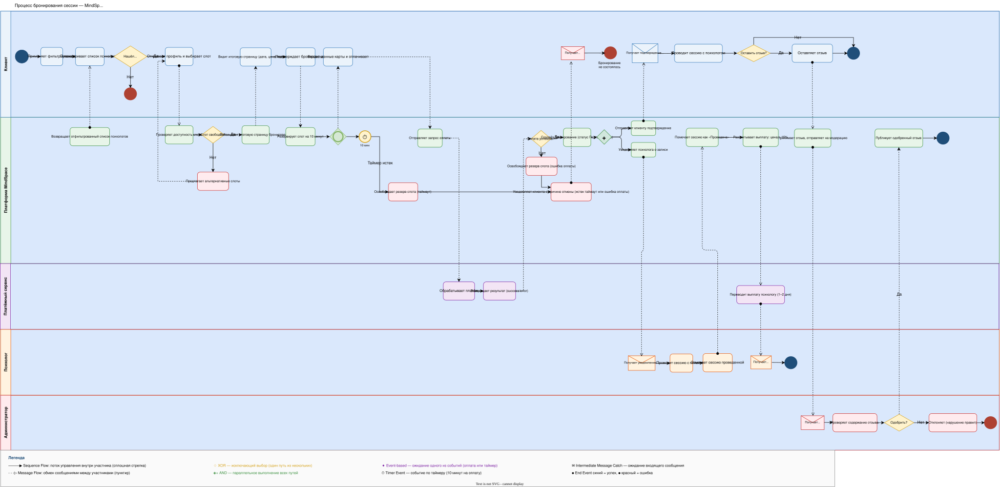
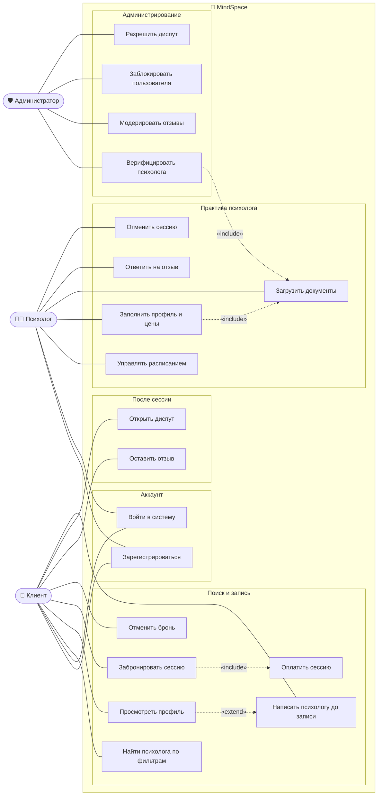
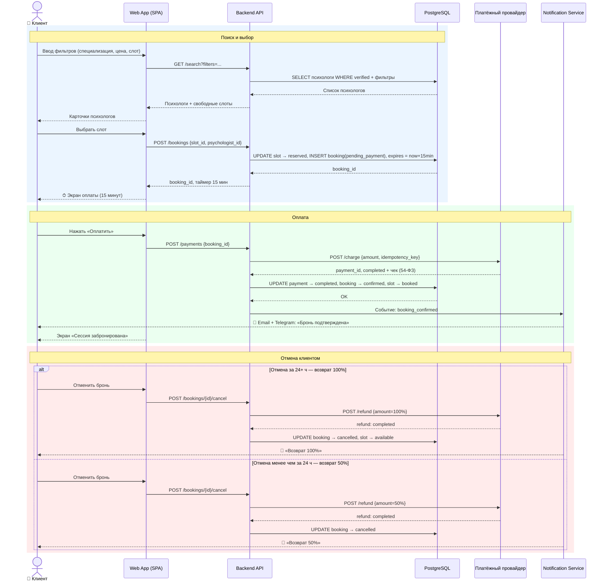
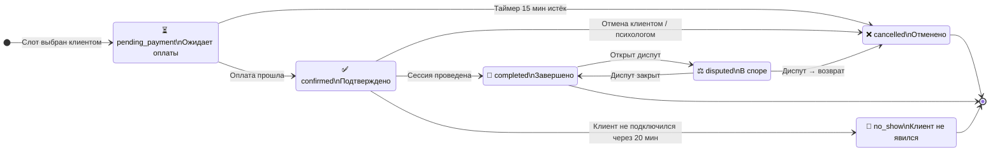
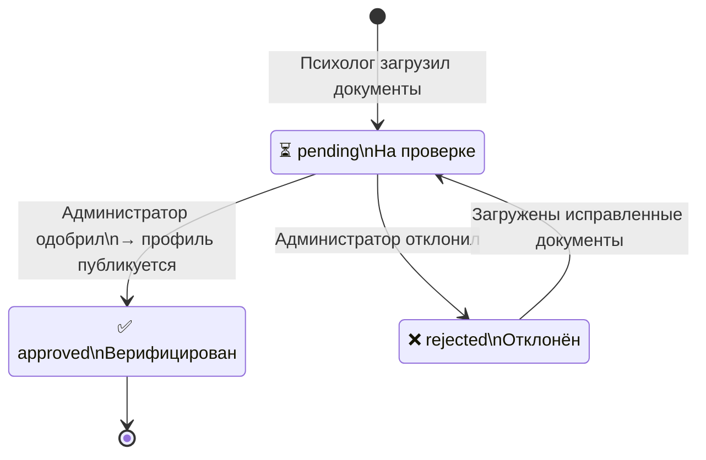
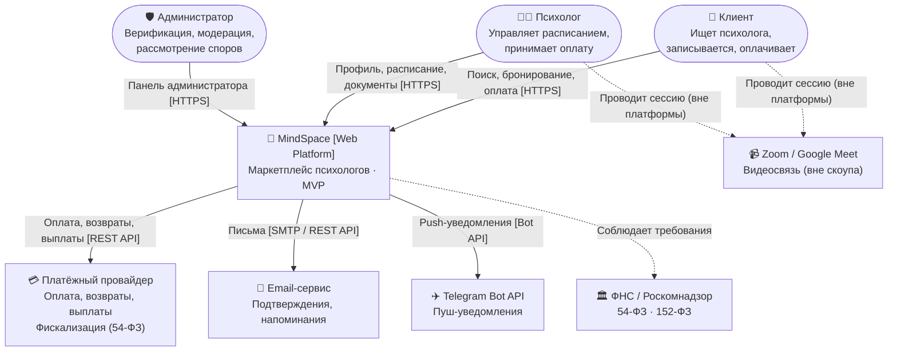
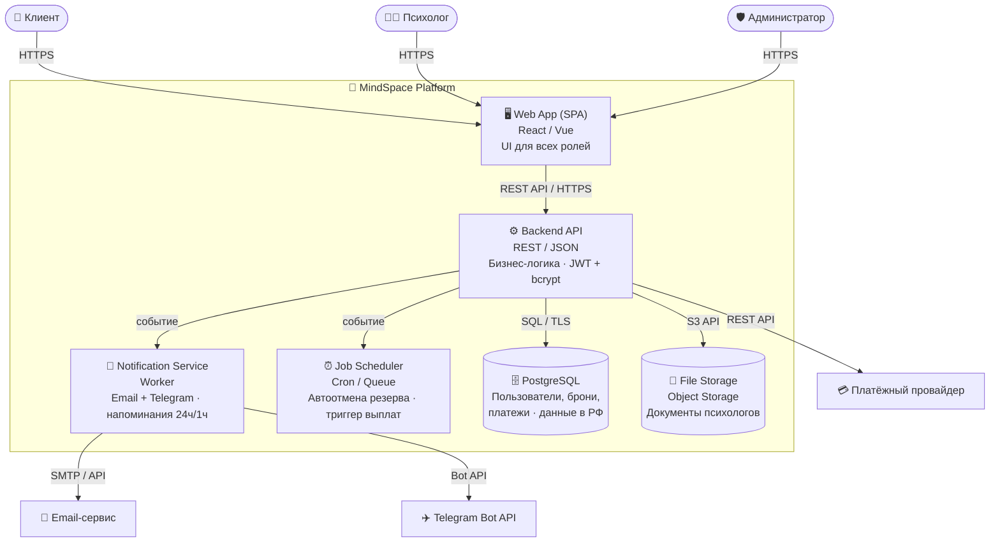
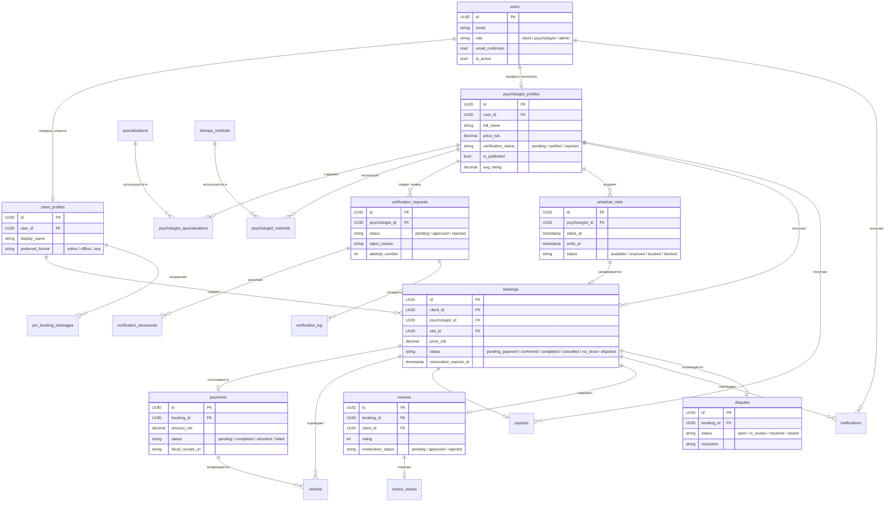

# 🧠 MindSpace — Маркетплейс психологов

> Учебный проект системного аналитика · Полный цикл аналитики от BRD до прототипа UI

**Автор:** Тезикова Елена · Системный аналитик  
**Версия:** 2.0 · Май 2026  
**Статус:** в работе


---

## 📌 О проекте

**MindSpace** — платформа для подбора психологов и онлайн-записи на сессии.  
Клиент находит специалиста по параметрам (специализация, формат, цена, язык), бронирует слот и оплачивает сессию. Психолог управляет расписанием, загружает документы для верификации и получает выплаты.

**Роли:** Клиент · Психолог · Администратор · Служба поддержки  
**MVP включает:** поиск и подбор, бронирование, онлайн-оплата (54-ФЗ), верификация психологов, отзывы с модерацией, уведомления (Email + Telegram), управление спорами  
**Вне скоупа MVP:** встроенный видеозвонок, групповые сессии, мобильное приложение, B2B-модуль  
**Регуляторные требования:** 54-ФЗ (онлайн-касса), 152-ФЗ (персональные данные), хранение данных в РФ

---

## 📂 Структура репозитория

```
📁 psychology-booking-system/
├── README.md
├── 📁 docs/
│   ├── BRD_MindSpace.docx              ← бизнес-требования
│   └── UserStories_MindSpace.docx      ← пользовательские истории (22 US)
├── 📁 diagrams/
│   ├── booking_process.bpmn            ← BPMN: процесс бронирования
│   ├── booking_process_drawio.svg      ← BPMN: визуализация (draw.io SVG)
│   ├── er_mindspace.puml               ← ER-диаграмма (8 доменов)
│   ├── 📁 uml/
│   │   ├── usecase_mindspace.puml      ← Use Case
│   │   ├── sequence_booking_mindspace.puml  ← Sequence: бронирование
│   │   └── statemachine_mindspace.puml ← State Machine
│   └── 📁 c4/
│       ├── c4_level1_context.puml      ← Context
│       ├── c4_level2_container.puml    ← Container
│       └── c4_level3_component.puml    ← Component
└── 📁 api/
    ├── mindspace_api.json              ← OpenAPI 3.0.3 спецификация
    └── mindspace_swagger.html          ← Swagger UI (интерактивная документация)
```

---

## 📋 Артефакты

### 1. BRD — Business Requirements Document ✅

Описывает бизнес-цели, проблему, заинтересованные стороны, персоны и высокоуровневые требования к платформе MindSpace.

**Ключевые разделы:** бизнес-контекст · персоны (Анна / Дмитрий / Мария) · процессы To-Be · функциональные и нефункциональные требования · риски · критерии успеха MVP

👉 [docs/BRD_MindSpace.docx](./docs/BRD_MindSpace.docx)

---

### 2. User Stories ✅

22 пользовательские истории по 8 эпикам с критериями приёмки, Definition of Ready и Definition of Done.

| Эпик | User Stories |
|------|-------------|
| Регистрация и профиль | US-01 – US-04, US-17 |
| Поиск и подбор | US-05 – US-06a |
| Бронирование | US-07 – US-10, US-18 |
| Оплата | US-11 – US-12, US-19 |
| Отзывы | US-13, US-20 |
| Уведомления | US-14 – US-15 |
| Верификация психологов | US-16, US-21 |
| Споры и поддержка | US-22 |

👉 [docs/UserStories_MindSpace.docx](./docs/UserStories_MindSpace.docx)

---

### 3. BPMN — процесс бронирования ✅

Три дорожки: Клиент · Платформа MindSpace · Психолог.  
Покрывает: поиск, проверку слота, 15-минутный резерв, оплату, подтверждение, завершение сессии, отмену и обработку ошибок.

 

👉 [diagrams/booking_process.bpmn](./diagrams/booking_process.bpmn) · [booking_process_drawio.svg](./diagrams/booking_process_drawio.svg)

---

### 4. UML-диаграммы ✅

#### Use Case

Взаимодействие трёх акторов (Клиент, Психолог, Администратор) с функциями платформы.



👉 [diagrams/uml/usecase_mindspace.puml](./diagrams/uml/usecase_mindspace.puml)

---

#### Sequence Diagram — бронирование сессии

Happy Path + сценарий отмены клиентом.



👉 [diagrams/uml/sequence_booking_mindspace.puml](./diagrams/uml/sequence_booking_mindspace.puml)

---

#### State Machine — жизненный цикл сущностей





👉 [diagrams/uml/statemachine_mindspace.puml](./diagrams/uml/statemachine_mindspace.puml)

---

### 5. C4 Model ✅

#### Level 1 — System Context



#### Level 2 — Container



👉 [diagrams/c4/c4_level1_context.puml](./diagrams/c4/c4_level1_context.puml) · [c4_level2_container.puml](./diagrams/c4/c4_level2_container.puml) · [c4_level3_component.puml](./diagrams/c4/c4_level3_component.puml)

---

### 6. ER-диаграмма ✅



👉 [diagrams/er_mindspace.puml](./diagrams/er_mindspace.puml)

---

### 7. REST API ✅

Спецификация в формате OpenAPI 3.0.3. Аутентификация: Bearer JWT.  
**Серверы:** `https://api.mindspace.ru/v1` · `https://api-staging.mindspace.ru/v1`

> 🔍 **[Открыть API в Swagger Editor](https://editor.swagger.io/?url=https://raw.githubusercontent.com/elenatezikova-sa/psychology-booking-system/main/api/mindspace_api.json)

<details>
<summary>▶ Показать все эндпоинты (31)</summary>

| Метод | Путь | Описание |
|-------|------|----------|
| `POST` | `/auth/register/client` | Регистрация клиента |
| `POST` | `/auth/register/psychologist` | Регистрация психолога |
| `POST` | `/auth/login` | Вход в систему |
| `POST` | `/auth/refresh` | Обновление access токена |
| `POST` | `/auth/confirm-email` | Подтверждение email |
| `GET` | `/client/profile` | Получить профиль клиента |
| `PUT` | `/client/profile` | Обновить профиль клиента |
| `DELETE` | `/client/profile` | Запрос на удаление аккаунта |
| `GET` | `/psychologist/profile` | Собственный профиль психолога |
| `PUT` | `/psychologist/profile` | Обновить профиль психолога |
| `GET` | `/psychologists/{id}/profile` | Публичный профиль психолога |
| `GET` | `/psychologist/documents` | Список загруженных документов |
| `POST` | `/psychologist/documents` | Загрузить документ для верификации |
| `GET` | `/psychologist/stats` | Статистика и история выплат |
| `GET` | `/search/psychologists` | Поиск психологов по фильтрам |
| `GET` | `/dictionaries/specializations` | Справочник специализаций |
| `GET` | `/dictionaries/methods` | Справочник методов работы |
| `GET` | `/messages` | История переписки |
| `POST` | `/messages` | Отправить сообщение психологу до записи |
| `GET` | `/psychologist/schedule` | Расписание психолога |
| `POST` | `/psychologist/schedule/slots` | Создать слоты расписания |
| `DELETE` | `/psychologist/schedule/slots/{slot_id}` | Удалить / заблокировать слот |
| `GET` | `/psychologists/{id}/slots` | Доступные слоты для клиента |
| `POST` | `/bookings` | Создать бронирование |
| `GET` | `/bookings` | Список сессий клиента |
| `GET` | `/bookings/{id}` | Детали бронирования |
| `POST` | `/bookings/{id}/cancel` | Отменить бронирование |
| `POST` | `/bookings/{id}/no-show` | Отметить no-show клиента |
| `GET` | `/bookings/{id}/calendar.ics` | Скачать .ics для календаря |
| `POST` | `/payments` | Инициировать оплату бронирования |
| `POST` | `/payments/webhook` | Webhook от платёжного провайдера |

</details>

👉 [api/mindspace_api.json](./api/mindspace_api.json) · [Swagger UI](./api/mindspace_swagger.html)

---

### 8. SQL — схема и данные 🚧 в работе

Создание таблиц и наполнение тестовыми данными по ER-диаграмме.

---

### 9. n8n Workflow 🚧 в работе

Автоматизация уведомлений: напоминание клиенту за 24 часа и за 1 час до сессии, уведомление психологу о новом бронировании.

---

### 10. Figma — прототипы интерфейсов 🚧 в работе

Экраны для клиента (поиск, бронирование, профиль) и для психолога (расписание, верификация, история выплат).

---

## 🛠 Инструменты

| Артефакт | Инструмент |
|----------|------------|
| BRD, User Stories | Word / Notion |
| BPMN | bpmn-js / Camunda Modeler |
| Use Case, Sequence, State Machine, C4, ER | PlantUML |
| API | OpenAPI 3.0.3 / Swagger |
| SQL | PostgreSQL |
| Workflow | n8n |
| UI-прототипы | Figma |

---

## 👤 Автор

**Тезикова Елена** · Системный аналитик

[](https://linkedin.com/in/your-profile)
[](https://t.me/your-username)
